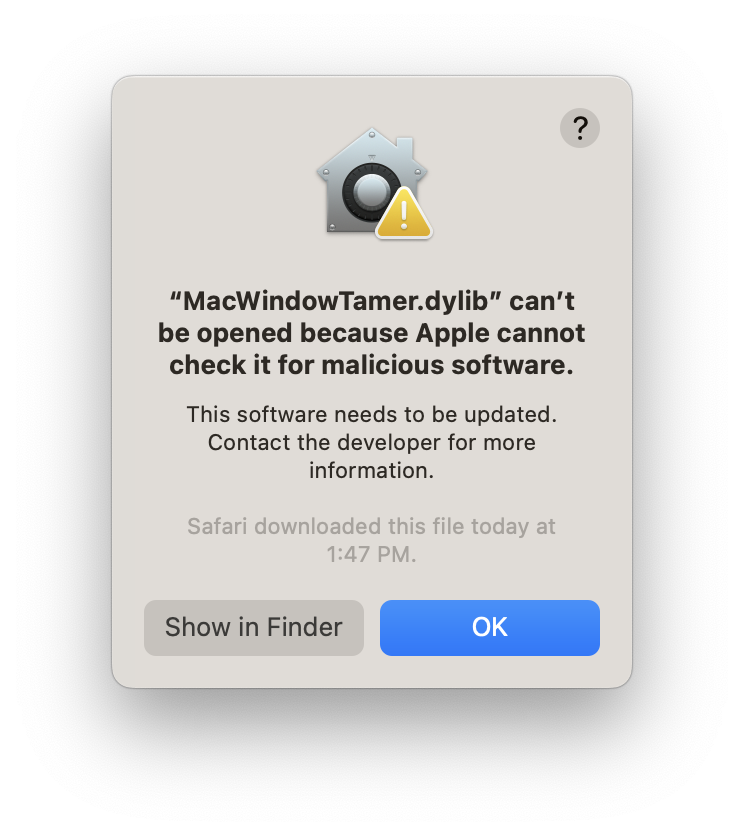

The aim of this Add-In is to improve how Fusion's various browser and tool windows behave on the Mac. It does this by establishing parent/child relationships between windows so MacOS's Window Server can keep them correctly ordered or corralled in the correct Space. 

**To Install:**

- Download and open the [release disk image](https://github.com/kadakadak/MacWindowTamer/releases/download/v0.9/MacWindowTamer.dmg). 
- You'll see an alias to the AddIns folder.
- Drag the MacWindowTamer folder into the AddIns folder. If it doesn't work, try opening the AddIns folder first
- Launch Fusion 360
- Open the Add-Ins panel
- Select MacWindowTamer on the Add-Ins side of the the Script/Add-Ins picker
- Run it
- The first time you try to run it, you'll see something like this:

- Go to System Settings : Privacy and Security and "Allow Anyway"

- Relaunch Fusion and attempt to run the plugin again
- You'll get a second dialog:

- Again, go back to System Settings : Privacy and Security and "Allow Anyway"

- Go back to Fusion, start the Add In and see that it's running (You should see a little spinner next to it)
- Select Run on Startup if you like

Alternatively, you can build it yourself and copy the project to:
`~/Library/Application Support/Autodesk/Autodesk Fusion 360/API/AddIns`

**Is It Working?**

You should no longer see the component browser briefly appear over other apps when you switch to them. You should also find that Fusion windows stay in their assigned Space.

**Feedback**

Fusion is a big app and I certainly don't use all of it! If this plugin causes a problem or doesn't fix a particular scenario, write up an issue and lets see if we can get it addressed. 
